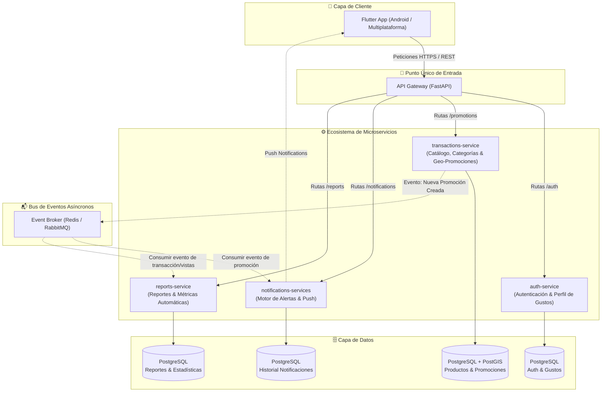

# 🏷️ Ofertapp

**Ofertapp** es una plataforma integral diseñada como un repositorio geolocalizado de ofertas de servicios y productos en una ciudad. La solución combina un catálogo dinámico de promociones con un motor de perfilado de gustos e intereses del usuario, permitiendo filtrar ofertas personalizadas, encontrar las opciones más cercanas en tiempo real y disparar alertas proactivas ante nuevas promociones de su interés.

---

## 🏗️ Arquitectura del Sistema

La arquitectura está basada en microservicios desacoplados expuestos a través de un **API Gateway**, con comunicación síncrona vía HTTP/REST y asíncrona mediante un **Message/Event Broker** (RabbitMQ / Redis) para procesamiento de notificaciones y generación de reportes en segundo plano. La persistencia se gestiona en **PostgreSQL** con la extensión geoespacial **PostGIS**.



---

## 🧩 Propósito de Cada Componente

### 1. 📱 Frontend (`/frontend`)
* **Tecnología**: Flutter (Dart) orientado a Android y soporte multiplataforma.
* **Propósito**:
  * **Pantalla de Inicio (Feed Principal)**: Muestra el catálogo de ofertas y promociones vigentes al usuario común, ordenadas y filtradas por dos criterios clave:
    * **Personalización**: Ofertas que coinciden con los gustos y categorías favoritas del usuario.
    * **Proximidad Geográfica**: Ofertas más cercanas a la posición GPS actual del usuario calculando distancia en tiempo real.
  * **Módulo de Registro de Promociones**: Interfaz administrativa y de comercios para publicar promociones (título, descripción, precio/descuento, fotos, categorías/etiquetas, geolocalización del local y fechas de vigencia).
  * **Configuración de Preferencias / Gustos**: Pantalla donde el usuario selecciona sus categorías de interés (ej. gastronomía, tecnología, indumentaria, belleza) y radio de búsqueda preferido.
  * **Bandeja y Recepción de Alertas**: Recepción de notificaciones push cuando se publica una oferta que encaja con sus gustos o ubicación.

---

### 2. 🚪 API Gateway (`/api-gateway`)
* **Tecnología**: FastAPI (Python) + Uvicorn.
* **Propósito**:
  * Funciona como el punto de entrada unificado (*Single Entry Point*) para la aplicación Flutter.
  * **Enrutamiento y Proxy Inverso**: Redirige las peticiones al microservicio correspondiente (`/api/v1/auth`, `/api/v1/promotions`, `/api/v1/notifications`, `/api/v1/reports`).
  * **Autenticación Centralizada**: Validación de tokens JWT en peticiones protegidas antes de delegar la llamada al microservicio de destino.
  * **Control de Tráfico y Seguridad**: Rate limiting, políticas CORS y normalización de respuestas y errores.

---

### 3. 🔐 Microservicio de Autenticación (`/services/auth-service`)
* **Tecnología**: FastAPI + SQLAlchemy / Tortoise ORM + PostgreSQL.
* **Propósito**:
  * **Gestión de Cuentas y Seguridad**: Registro de usuarios, inicio de sesión, generación y rotación de tokens JWT, control de roles (`comercio`, `usuario`, `administrador`).
  * **Base de Datos de Gustos del Usuario**: Almacenamiento y gestión del perfil de intereses (tags, categorías favoritas, marcas preferidas, rango de distancia máxima deseada para alertas).
  * Exposición de endpoints para que otros servicios consulten las audiencias objetivo según gustos.

---

### 4. 🏷️ Microservicio de Transacciones y Catálogo (`/services/transactions-service`)
* **Tecnología**: FastAPI + GeoAlchemy2 + PostgreSQL con extensión **PostGIS**.
* **Propósito**:
  * **Registro y Categorización**: CRUD de comercios, productos, servicios y promociones con su categorización jerárquica y etiquetas de contenido.
  * **Búsqueda Geoespacial**: Consulta de ofertas cercanas al usuario utilizando funciones nativas de PostGIS (`ST_DWithin`, `ST_Distance`) a partir de la latitud y longitud enviadas por la app.
  * **Filtrado Combinado**: Cruce de ofertas por proximidad y categorías coincidentes con los gustos del usuario.
  * **Publicación de Eventos**: Cada vez que se activa o registra una nueva promoción, emite un evento `PromotionActivatedEvent` al bus de eventos para que el servicio de notificaciones reaccione de inmediato.

---

### 5. 🔔 Microservicio de Notificaciones (`/services/notifications-services`)
* **Tecnología**: FastAPI + Celery / Background Workers + Firebase Cloud Messaging (FCM).
* **Propósito**:
  * **Motor de Matching de Alertas**: Escucha eventos de nuevas promociones creadas en el sistema, consulta los usuarios cuyos gustos coincidan con la categoría/tags de la oferta y que se encuentren dentro del radio de alcance geográfico.
  * **Despacho Multicanal**: Envío de alertas Push a dispositivos móviles (FCM), notificaciones in-app y correo electrónico según preferencias del usuario.
  * **Historial de Notificaciones**: Registro de alertas enviadas y estado de lectura.

---

### 6. 📊 Microservicio de Reportes (`/services/reports-service`)
* **Tecnología**: FastAPI + Pandas / Polars / ReportLab + Tareas Programadas (Cron/Workers).
* **Propósito**:
  * **Reportes Automáticos**: Generación periódica de métricas de rendimiento para los comercios (número de visualizaciones de promociones, interacciones, clics en mapa/cómo llegar).
  * **Analítica de Demanda y Gustos**: Identificación de las categorías y gustos más buscados por zona o barrio en la ciudad para ayudar a los comercios a crear ofertas más efectivas.
  * **Exportación de Documentos**: Generación de reportes en PDF y Excel disponibles para descarga o envío automático por correo.

---

### 7. 🗄️ Base de Datos y Servicios de Soporte
* **PostgreSQL + PostGIS**: Almacenamiento relacional y geoespacial robusto, garantizando consultas espaciales ultrarrápidas sobre coordenadas de comercios y promociones.
* **Message / Event Broker (RabbitMQ o Redis)**: Permite la comunicación desacoplada y asíncrona entre `transactions-service`, `notifications-services` y `reports-service`.

---

## 📁 Estructura del Repositorio

```text
ofertapp/
├── README.md                      # Documentación general y arquitectura
├── docker-compose.yml             # Orquestación de contenedores locales
├── api-gateway/                   # Punto de entrada FastAPI (routing y JWT)
│   ├── app/
│   ├── Dockerfile
│   └── requirements.txt
├── services/
│   ├── auth-service/              # Autenticación, usuarios y gustos
│   │   ├── app/
│   │   ├── Dockerfile
│   │   └── requirements.txt
│   ├── transactions-service/      # Promociones, productos, categorías y PostGIS
│   │   ├── app/
│   │   ├── Dockerfile
│   │   └── requirements.txt
│   ├── notifications-services/    # Despacho de alertas y push por gustos
│   │   ├── app/
│   │   ├── Dockerfile
│   │   └── requirements.txt
│   └── reports-service/          # Reportes analíticos automáticos
│       ├── app/
│       ├── Dockerfile
│       └── requirements.txt
└── frontend/                      # Aplicación móvil Flutter
    ├── lib/
    ├── pubspec.yaml
    └── ...
```

---

## 🔄 Flujos Clave del Negocio

### Flujo A: Visualización Personalizada y por Cercanía (Pantalla Principal)
1. El usuario abre la app Flutter.
2. La app obtiene la ubicación actual vía GPS (latitud y longitud) y el token JWT de sesión.
3. Se realiza una solicitud a `GET /api/v1/promotions/feed?lat={lat}&lng={lng}` a través del API Gateway.
4. El `transactions-service` filtra las ofertas activas ordenándolas por:
   * Coincidencia con la base de datos de gustos del usuario registrada en `auth-service`.
   * Proximidad en kilómetros (cálculo PostGIS).
5. La pantalla principal renderiza el listado priorizado con indicador de distancia (ej. "A 350 m de ti").

### Flujo B: Registro de Promoción y Disparo de Alertas Automáticas
1. Un comercio da de alta una oferta desde la interfaz de registro indicando categoría, tags, descuento, vigencia y ubicación del local.
2. La petición viaja por el API Gateway hasta `transactions-service`, donde se guarda en la base de datos.
3. `transactions-service` publica el evento `PromotionCreated` en el Event Broker.
4. `notifications-services` consume el evento, identifica qué usuarios tienen registrados gustos coincidentes con la promoción y se encuentran en la zona geográfica correspondiente.
5. Se dispara una notificación Push personalizada a los dispositivos de los usuarios seleccionados: *"¡Nueva oferta de tu interés cerca de ti!"*.
