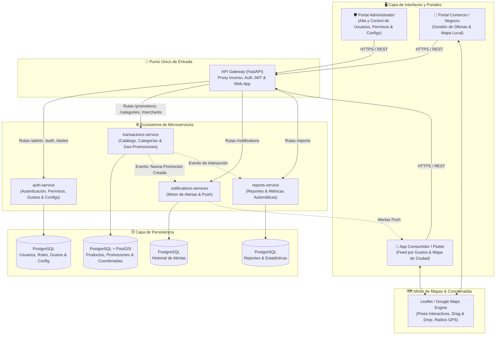

# 🏷️ Ofertapp

**Ofertapp** es una plataforma integral diseñada como un repositorio geolocalizado de ofertas de servicios y productos en una ciudad. La solución combina un catálogo dinámico de promociones con un motor de perfilado de gustos e intereses del usuario, interfaces dedicadas para **Administradores** (con alta y gestión completa de usuarios, permisos y configuraciones globales), **Comercios (Portal de Negocio)** y **Consumidores**, un sistema granular de **permisos y configuraciones**, y visualización de locales en **mapas interactivos estilo Google Maps**.

---

## 🏗️ Arquitectura del Sistema

La arquitectura está basada en microservicios desacoplados expuestos a través de un **API Gateway**, con comunicación síncrona vía HTTP/REST y asíncrona mediante un **Message/Event Broker** (RabbitMQ / Redis). Soporta consultas geoespaciales con **PostGIS / Haversine** y mapas interactivos cliente (**Leaflet / Google Maps API**).


```mermaid
flowchart TD
    subgraph Clients["🖥️ Capa de Interfaces y Portales"]
        ADMIN["🛡️ Portal Administrador\n(Alta y Control de Usuarios, Permisos & Configs)"]
        MERCHANT["🏪 Portal Comercio / Negocio\n(Gestión de Ofertas & Mapa Local)"]
        CONSUMER["📱 App Consumidor / Flutter\n(Feed por Gustos & Mapa de Ciudad)"]
    end

    subgraph Gateway["🚪 Punto Único de Entrada"]
        APIGW["API Gateway (FastAPI)\nProxy Inverso, Auth JWT & Web App"]
    end

    subgraph Services["⚙️ Ecosistema de Microservicios"]
        AUTH["auth-service\n(Autenticación, Permisos, Gustos & Configs)"]
        TRANS["transactions-service\n(Catálogo, Categorías & Geo-Promociones)"]
        NOTIF["notifications-services\n(Motor de Alertas & Push)"]
        REPORTS["reports-service\n(Reportes & Métricas Automáticas)"]
    end

    subgraph MapEngine["🗺️ Motor de Mapas & Coordenadas"]
        LEAFLET["Leaflet / Google Maps Engine\n(Pines Interactivos, Drag & Drop, Radios GPS)"]
    end

    subgraph Storage["🗄️ Capa de Persistencia"]
        DB_AUTH[("PostgreSQL\nUsuarios, Roles, Gustos & Config")]
        DB_TRANS[("PostgreSQL + PostGIS\nProductos, Promociones & Coordenadas")]
        DB_NOTIF[("PostgreSQL\nHistorial de Alertas")]
        DB_REPORTS[("PostgreSQL\nReportes & Estadísticas")]
    end

    ADMIN -->|HTTPS / REST| APIGW
    MERCHANT -->|HTTPS / REST| APIGW
    CONSUMER -->|HTTPS / REST| APIGW

    MERCHANT <--> LEAFLET
    CONSUMER <--> LEAFLET

    APIGW -->|Rutas /admin, /auth, /tastes| AUTH
    APIGW -->|Rutas /promotions, /categories, /merchants| TRANS
    APIGW -->|Rutas /notifications| NOTIF
    APIGW -->|Rutas /reports| REPORTS

    AUTH --> DB_AUTH
    TRANS --> DB_TRANS
    NOTIF --> DB_NOTIF
    REPORTS --> DB_REPORTS

    TRANS -.->|Evento: Nueva Promoción Creada| NOTIF
    TRANS -.->|Evento de Interacción| REPORTS
    NOTIF -.->|Alertas Push| CONSUMER
```

---

## 👥 Interfaces y Portales del Sistema

### 1. 🛡️ Portal Administrador (`Admin Portal`)
* **Propósito**: Panel de control total para supervisar la plataforma, gobernar usuarios y modificar parámetros de negocio.
* **Funcionalidades Clave**:
  * **Alta y Creación de Usuarios (`POST /admin/users`)**: Los administradores pueden registrar y dar de alta directamente nuevos usuarios, comercios u otros administradores desde el panel web o API, especificando su nombre, email, contraseña inicial, teléfono y rol (`user`, `merchant`, `admin`).
  * **Gestión de Permisos y Roles (`PUT /admin/users/{id}/role` y `PUT /admin/users/{id}`)**: Listado interactivo en tiempo real de todos los usuarios registrados, asignación dinámica de roles en vivo, suspensión/activación inmediata de cuentas y eliminación permanente (`DELETE /admin/users/{id}`).
  * **Administración de Configuraciones del Sistema**: Interfaz para editar y persistir parámetros operativos globales:
    * `default_search_radius_km`: Radio de búsqueda por defecto en la ciudad.
    * `max_search_radius_km`: Radio máximo permitido para filtrar ofertas.
    * `default_map_lat` y `default_map_lon`: Coordenadas centrales por defecto del mapa.
    * `auto_push_notifications`: Habilitar o pausar el despacho masivo de alertas por gustos.
    * `max_promotions_per_merchant`: Límite máximo de ofertas simultáneas por comercio.
    * `require_merchant_verification`: Exigir aprobación manual antes de publicar.
  * **Gestión de Categorías (CRUD)**: Creación, edición y eliminación de categorías del catálogo general con sus respectivos iconos y slugs.

---

### 2. 🏪 Portal de Comercio / Negocio (`Merchant Portal`)
* **Propósito**: Espacio de trabajo para los comercios locales donde administran su catálogo y ubicación geográfica.
* **Funcionalidades Clave**:
  * **Gestión de Promociones**: Listado de ofertas propias con estado en tiempo real (Activa / Pausada), contador de visualizaciones y opción de eliminar o editar.
  * **Integración de Coordenadas con Mapa Interactivo (estilo Google Maps)**:
    * Mapa interactivo integrado donde el comerciante puede hacer clic o arrastrar un pin/marcador hacia la ubicación exacta de su local.
    * Captura automática y sincronización de `latitud`, `longitud` y dirección.
    * Visualización del radio de alcance geográfico de la oferta.
  * **Segmentación por Gustos**: Definición de etiquetas clave (`tags`) que dispararán alertas a los clientes afines en la zona.

---

### 3. 📱 Interfaz de Consumidor / Usuario Final (`Client App`)
* **Propósito**: Aplicación móvil y web para descubrir ofertas, filtradas por proximidad y afinidad de gustos, con opción de búsqueda directa.
* **Funcionalidades Clave**:
  * **Creación de Cuenta Personal (Autoregistro)**:
    * Permite que los usuarios creen su propia cuenta (`POST /auth/register`) con nombre, correo y contraseña.
    * Al iniciar sesión (`POST /auth/login`), sus gustos e intereses quedan guardados de forma persistente en la nube.
    * Funciona tanto para usuarios registrados como en modo invitado (con almacenamiento local de prueba).
  * **Gestión Integral de Perfil de Usuario, Identidad y Seguridad**:
    * **Interfaz Dedicada y Accesible**: Botón directo de edición en la tarjeta del Drawer (*✏️ Mi Perfil de Usuario*), acceso rápido con foto de avatar en la cabecera del feed y pestaña especial en el Portal de Comercio (*🏪 Mi Negocio*).
    * **Identidad Visual & Portada**: Configuración de **Nombre**, **Logo / Avatar** circular y **Banner de Cabecera** con previsualización en vivo en tiempo real y selector de estilos predefinidos (Gastronomía, Verano, Cyber Tech, Tienda Urbana).
    * **Datos de Contacto**: Correo electrónico, teléfono / WhatsApp de contacto y biografía o descripción del negocio/usuario.
    * **Integración de Redes Sociales**: Conexión de perfiles directos de **Instagram**, **WhatsApp**, **Facebook**, **X (Twitter)** y **Sitio Web / Tienda Online** con badges visuales.
    * **Seguridad y Cambio de Contraseña (`POST /auth/change-password`)**: Módulo seguro para modificar la clave de acceso con verificación de contraseña actual, medidor de seguridad y confirmación en tiempo real.
  * **Configurador de Gustos (Agregar y Quitar Preferencias)**:
    * **Categorías**: Selección interactiva de categorías favoritas (activar/desactivar con un clic).
    * **Etiquetas y Palabras Clave (Tags)**: Sistema dinámico con chips donde el usuario puede **agregar nuevos gustos** (ej: `pizza`, `sushi`, `zapatillas`, `auriculares`) y **quitar gustos existentes** pulsando sobre la `✕` de cada etiqueta.
    * **Radio de Notificación**: Selector deslizante del radio GPS deseado (5 km, 10 km, 15 km, 25 km).
    * Al guardar, los cambios se persisten mediante `PUT /api/v1/tastes/me` y `DELETE /api/v1/tastes/me/{category_id}`.
  * **Buscador de Promociones**:
    * Buscador integrado en la cabecera del feed que permite buscar ofertas por texto libre (nombre de producto, plato, tienda o tag).
    * **Diseñado especialmente para usuarios que no tienen gustos configurados** o que desean explorar ofertas específicas fuera de su perfil habitual.
    * Soporta limpieza rápida de búsqueda (`✕`), filtrado en tiempo real y mensaje con sugerencias cuando no hay coincidencias.
  * **Feed Personalizado**: Listado clasificado con insignias de descuento (*-50% OFF*), indicador de distancia (*a 70 m*, *a 340 m*), insignia de fotos (*📸 4 fotos*) y badge de afinidad (*⭐ Tus gustos*).
  * **Ficha de Detalle con Galería de Fotos & Descripción Enriquecida**:
    * Visor de fotos interactivo en alta resolución con controles anterior/siguiente (`‹` / `›`), contador dinámico (`📸 1 / 4`) y carrusel de miniaturas seleccionables con reborde activo.
    * Descripción completa del producto o servicio con desglose de qué incluye, calidad, términos y condiciones.
    * Desglose de precios (precio regular tachado, porcentaje de descuento y cálculo de ahorro estimado *¡Ahorras $X.XXX!*).
    * Ficha del comercio con dirección física verificada y botón directo para visualizarlo en el mapa interactivo.
  * **Pasarela de Compras y Pagos en Línea (Checkout)**:
    * Botón de compra directa (*💳 Comprar / Pagar en Línea*).
    * Selector dinámico de cantidades (`-` `1` `+`) con recálculo automático del total.
    * Múltiples métodos de pago integrados: Tarjetas de Crédito/Débito (Visa, Mastercard, Cabal), Mercado Pago / Billetera Digital y Transferencia Bancaria Directa.
    * Emisión instantánea de comprobante con Nº de Orden (`ORD-XXXX`), ID de Transacción (`TXN-XXXX`), monto total y **Token QR de seguridad** para canjear en el local.
  * **Mapa de Ofertas de la Ciudad**:
    * Vista completa interactiva estilo Google Maps que muestra la posición GPS actual del usuario (marcador azul pulsante) y los locales con ofertas como pines personalizados.
    * Al tocar un pin se abre una ficha emergente con foto, descuento, distancia y botones de acceso directo para abrir el visor de fotos y pagar en línea.
  * **Bandeja de Alertas**: Notificaciones proactivas recibidas cuando un negocio cercano activa una oferta compatible con su perfil de gustos.

---

## 🧩 Propósito de Cada Pieza del Backend

### 1. `auth-service` (Puerto 8001)
* **Autenticación & Autoregistro**: Registro de nuevas cuentas de consumidores (`POST /auth/register`), login seguro con `bcrypt` y tokens `JWT` (`POST /auth/login`).
* **Perfil de Usuario, Redes y Seguridad**: Consulta de perfil (`GET /auth/profile`, `GET /auth/me`), actualización integral de identidad, contacto, logo, banner y redes (`PUT /auth/profile`), y cambio seguro de contraseña (`POST /auth/change-password`).
* **Perfilado y CRUD de Gustos**: Gestión completa de preferencias del usuario (`GET /tastes/me`, `PUT /tastes/me`, `DELETE /tastes/me/{category_id}`).
* **Control de Usuarios & Roles**: Endpoints administrativos (`POST /admin/users`, `GET /admin/users`, `PUT /admin/users/{id}/role`, `DELETE /admin/users/{id}`).
* **Configuraciones Globales**: Endpoints de configuración (`GET /admin/settings`, `PUT /admin/settings/{key}`).
* **Matching de Audiencia**: Motor interno para cruzar coordenadas de una oferta con los usuarios que tengan ese gusto dentro del radio.

### 2. `transactions-service` (Puerto 8002)
* **Transacciones de Servicios y Productos**: Endpoints principales para registrar transacciones (`POST /transactions`) vinculando Servicio, Producto y Usuario con comprobantes, y consultar su listado con filtros (`GET /transactions`, `GET /transactions/{id}`).
* **Catálogo, Geo-Promociones & Galería de Imágenes**: CRUD de promociones con persistencia de coordenadas (`latitude`, `longitude`, `address`), foto de portada y URLs adicionales para galería multi-fotos (`gallery`).
* **Buscador Libre & Filtro de Proximidad**: Endpoint `GET /promotions/feed` con soporte de búsqueda por texto libre (`?search=...`), filtrado por categoría (`?category_id=...`), radio máximo (`?max_distance_km=...`) y ordenamiento por gustos afines (`?taste_tags=...` y `?taste_categories=...`).
* **Pasarela de Pagos en Línea & Órdenes**: Endpoints para procesar compras en línea (`POST /orders/checkout`), consultar comprobantes (`GET /orders/{order_number}`) y consultar ventas del comercio (`GET /merchants/{merchant_id}/orders`).
* **Portal de Comercios**: Endpoints específicos para comercios (`GET /merchants/{id}/promotions`, `PATCH /promotions/{id}/toggle-status`, `PUT /promotions/{id}`, `GET /merchants/{id}/orders`).
* **Disparo de Eventos**: Notifica al servicio de alertas al darse de alta una oferta.

### 3. `notifications-services` (Puerto 8003)
* **Motor de Alertas Georreferenciadas**: Procesa eventos de ofertas, consulta en `auth-service` los usuarios compatibles en la zona y genera alertas Push/in-app personalizadas.
* **Historial de Notificaciones**: Gestión de alertas leídas/no leídas.

### 4. `reports-service` (Puerto 8004)
* **Reportes Automáticos**: Métricas consolidadas de visualizaciones, ahorro estimado en la ciudad y mapa de demanda de gustos por zonas urbanas.

### 5. `api-gateway` (Puerto 8000)
* Punto único de entrada, proxy inverso hacia los microservicios (incluyendo rutas `/api/v1/transactions` y `/api/v1/orders`), inyección de roles JWT, CORS y servidor de la **Aplicación Web Interactiva** en `/app`.

---

## 📋 Matriz de CRUD por Microservicio (Crear, Leer, Escribir y Borrar)

Cada módulo de Ofertapp cuenta con su propio ciclo CRUD completo e independiente:

| Microservicio | Módulo / Entidad | Crear (Create) | Leer (Read) | Escribir / Editar (Update) | Borrar (Delete) |
| :--- | :--- | :--- | :--- | :--- | :--- |
| **`auth-service`** | **Cuentas de Consumidor** | `POST /auth/register` *(Autoregistro público)* | `GET /auth/me` | `PUT /auth/me` | `DELETE /admin/users/{id}` |
| **`auth-service`** | **Perfil, Redes & Contraseña** | `POST /auth/change-password` *(Cambio seguro)* | `GET /auth/profile`<br>`GET /auth/me` | `PUT /auth/profile` *(Nombre, logo, banner, redes)* | `DELETE /admin/users/{id}` |
| **`auth-service`** | **Usuarios (Admin)** | `POST /admin/users` *(Alta de usuarios, comercios y admins)* | `GET /admin/users`<br>`GET /admin/users/{id}` | `PUT /admin/users/{id}`<br>`PUT /admin/users/{id}/role` | `DELETE /admin/users/{id}` |
| **`auth-service`** | **Perfil de Gustos** | `PUT /tastes/me` *(Crear o sustituir gustos)* | `GET /tastes/me` | `PUT /tastes/me` | `DELETE /tastes/me/{category_id}` *(Quitar gusto)* |
| **`auth-service`** | **Categorías de Gustos** | `POST /admin/categories` | `GET /tastes/categories`<br>`GET /admin/categories/{id}` | `PUT /admin/categories/{id}` | `DELETE /admin/categories/{id}` |
| **`auth-service`** | **Configuraciones Globales** | `POST /admin/settings` | `GET /admin/settings`<br>`GET /admin/settings/{key}` | `PUT /admin/settings/{key}` | `DELETE /admin/settings/{key}` |
| **`transactions-service`** | **Transacciones (Servicio, Producto, Usuario)** | `POST /transactions` *(Crear asociando servicio, producto y usuario)* | `GET /transactions`<br>`GET /transactions/{id}`<br>`GET /transactions/code/{code}` | `PATCH /transactions/{id}` | N/A *(Auditado)* |
| **`transactions-service`** | **Promociones, Fotos & Buscador** | `POST /promotions` *(Con galería de imágenes y descripción)* | `GET /promotions/feed?search=...`<br>`GET /promotions/{id}`<br>`GET /merchants/{id}/promotions` | `PUT /promotions/{id}`<br>`PATCH /promotions/{id}/toggle-status` | `DELETE /promotions/{id}` |
| **`transactions-service`** | **Órdenes & Pagos en Línea** | `POST /orders/checkout` *(Pago con tarjeta, MP o transferencia)* | `GET /orders/{order_number}`<br>`GET /merchants/{id}/orders` | N/A *(Inmutable / Auditado)* | N/A |
| **`transactions-service`** | **Categorías del Catálogo** | `POST /categories` | `GET /categories`<br>`GET /categories/{id}` | `PUT /categories/{id}` | `DELETE /categories/{id}` |
| **`notifications-services`** | **Alertas / Notificaciones** | `POST /events/promotion-created`<br>`POST /notifications` | `GET /notifications/user/{id}`<br>`GET /notifications/{id}` | `PUT /notifications/{id}/read`<br>`PUT /notifications/{id}` | `DELETE /notifications/{id}`<br>`DELETE /notifications/user/{id}` |
| **`reports-service`** | **Reportes Analíticos** | `POST /reports/custom` | `GET /reports/dashboard-summary`<br>`GET /reports/merchant/{id}`<br>`GET /reports/zone-demand`<br>`GET /reports/custom` | `PUT /reports/custom/{id}` | `DELETE /reports/custom/{id}` |


---

## 📁 Estructura del Repositorio

```text
ofertapp/
├── README.md                      # Documentación completa y arquitectura
├── docker-compose.yml             # Orquestación de PostgreSQL PostGIS, Redis y microservicios
├── run_services.py                # Runner local para levantar todos los microservicios con un comando
├── requirements.txt               # Dependencias de Python consolidadas
├── api-gateway/                   # Gateway FastAPI y servidor Web
│   ├── web/
│   │   └── index.html             # App Web con Portales (Admin, Comercio con Mapa, Consumidor)
│   ├── main.py
│   └── Dockerfile
├── services/
│   ├── auth-service/              # Autenticación, usuarios, roles, gustos y configuraciones
│   ├── transactions-service/      # Promociones, catálogo, mapa geoespacial y portal comercio
│   ├── notifications-services/    # Despacho de alertas y notificaciones por gustos
│   └── reports-service/          # Reportes analíticos de demanda y métricas
└── frontend/                      # Aplicación móvil Flutter (Material 3)
    ├── lib/
    │   ├── screens/               # Pantallas (Feed, Registro, Gustos, Notificaciones)
    │   ├── widgets/               # Widgets (Tarjetas, Encabezado GPS, Pines)
    │   └── models/                # Modelos de datos
    └── pubspec.yaml
```

---

## 🚀 Cómo Ejecutar el Sistema

### Ejecución Local Rápida (Recomendada):
```powershell
cd d:\antigravity\ofertapp

# 1. Activar entorno virtual
.\.venv\Scripts\Activate.ps1

# 2. Levantar todos los microservicios y el API Gateway
python run_services.py
```

### URLs de Acceso:
* **📱 Plataforma Web (Consumidor, Portal Comercio & Admin):** [http://127.0.0.1:8000/app](http://127.0.0.1:8000/app)
* **📚 Documentación Interactiva Swagger (API Gateway):** [http://127.0.0.1:8000/docs](http://127.0.0.1:8000/docs)
* **🩺 Healthcheck Global:** [http://127.0.0.1:8000/health](http://127.0.0.1:8000/health)
